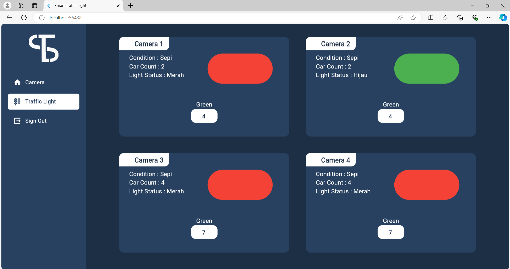
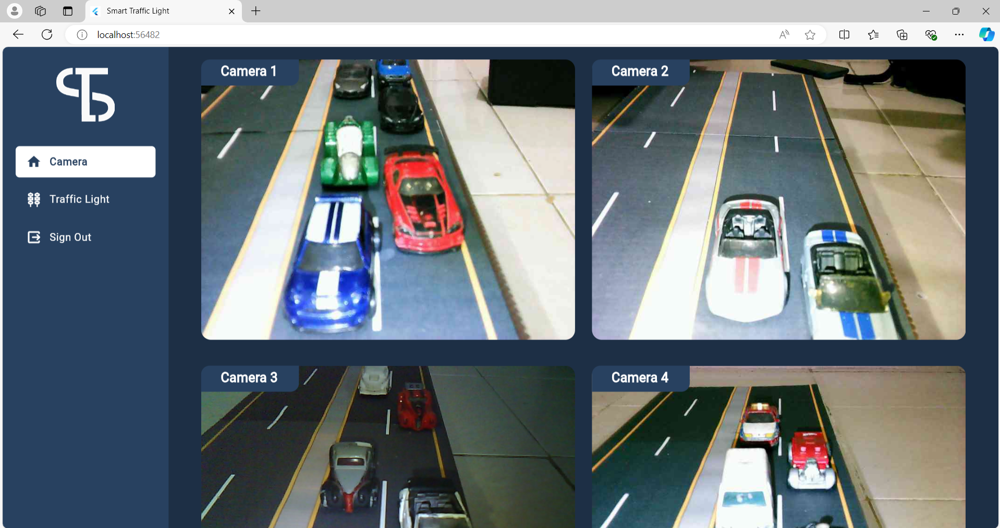
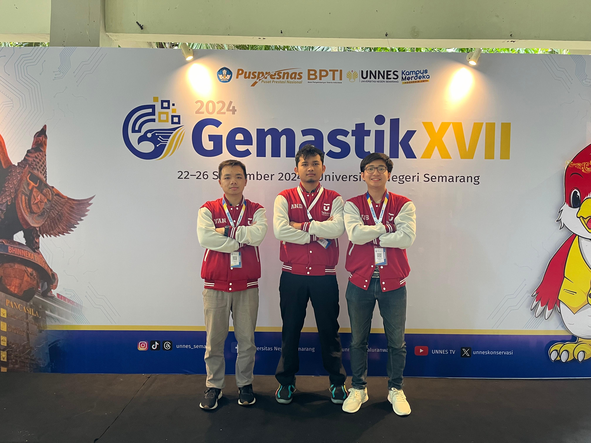
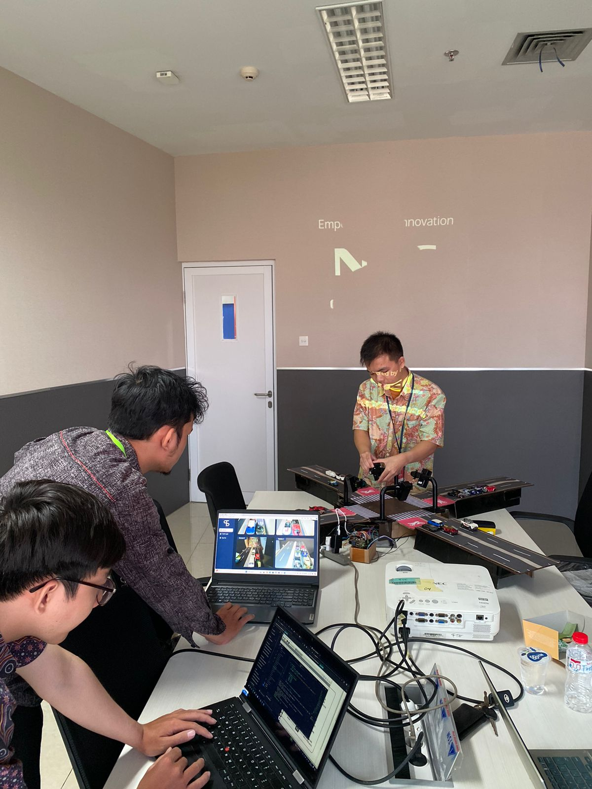
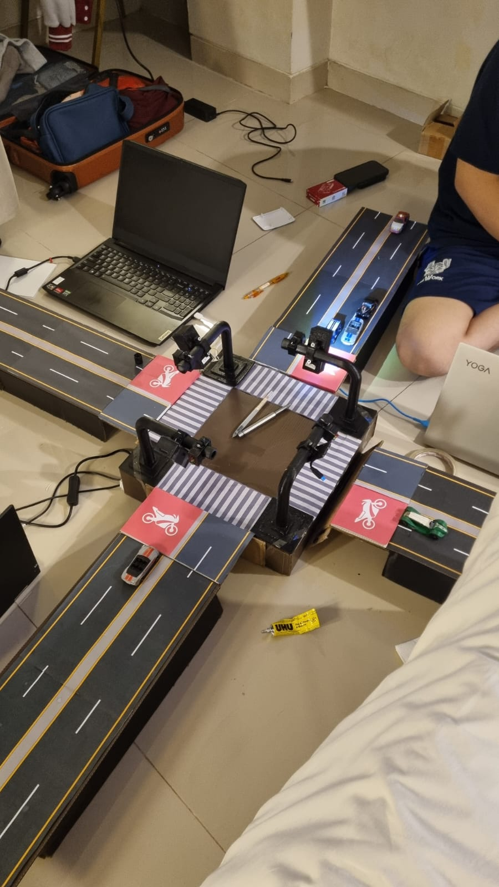

# GEMASTIK 2024 Competition Submission

Welcome to our official submission for the **GEMASTIK 2024 Competition**. This project showcases our innovative solution developed using Flutter Web, aiming to address real-world challenges through responsive and interactive user interfaces.

## 🌐 Project Overview

We developed a web-based application focusing on seamless integration between UI design, real-time data handling, and smart services. Our goal is to offer intuitive user interaction combined with responsive system performance using Firebase and Dart.

## 📁 Project Structure

```
├── img/            # Images and visual documentation
├── pages/          # Flutter Web UI pages
├── service/        # Business logic and Firebase service integrations
├── main.dart       # Main entry point of the Flutter web app
```

## 🛠 Technologies Used

* **Flutter Web (Dart)** – For building cross-platform web applications
* **Firebase Realtime Database** – For real-time data storage and sync
* **HTTP Protocol** – For backend communication

## 🚀 Getting Started

### Prerequisites

* Flutter SDK installed
* Firebase project configured

### Installation Steps

1. Clone the repository:

   ```bash
   git clone https://github.com/ndriuu/gemastik2024-competition.git
   ```
2. Navigate to the project directory:

   ```bash
   cd gemastik2024-competition
   ```
3. Install dependencies:

   ```bash
   flutter pub get
   ```
4. Run the web application:

   ```bash
   flutter run -d chrome
   ```

## 📱 UI/UX Showcase

Below are screenshots of our website interface:





## 📜 License

This project is licensed under the MIT License. See the `LICENSE` file for more details.

## Documentation



